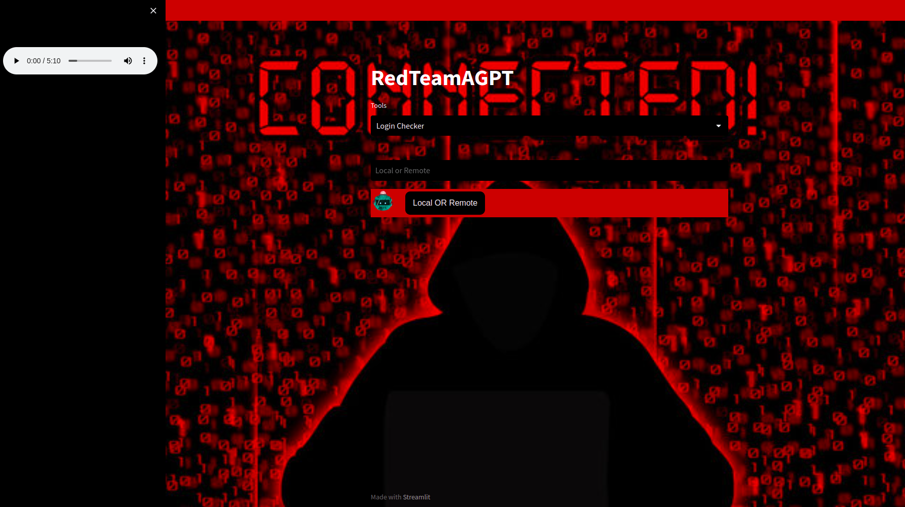

<h1 align="center">RED Auto-GPT</h1>

<h2 align="center"> Security Red Team Auto-GPT tool kit </h2>

<p align="center" >
    
</p>

We are working on creating a tool kit for security professionals that will help test network and other vulnerabilities for home and office using AutoGPT and Langchain

<h1 align="center"><b>⚠️🔴 NOT TO BE USED FOR ILLEGAL ACTIVITY 🔴⚠️</b></h1>

## Development
We are currently working on expanding tools.


# Environment
You should create a virtualenv with the required dependencies by running
```
make virtualenv
```

Activate the virtualenv by running
```
source ./.venv/bin/activate
```

When a new requirement is needed you should add it to `unpinned_requirements.txt` and run
```
make update-requirements-txt
make virtualenv
```
this ensure that all requirements are pinned and work together for ensuring reproducibility

## Make a copy of the example environment variables file
```
cp .env.example .env
```

# Run the app
```
streamlit run chatbot.py | tail -n +6 > tools/logs/logtest04292023.txt
```

# Project Summary

### Idea
Utilizing AutoGPT and LangChain, we use linux based network security tools for malware and intrusion prevention. Utilizing AI to keep your network secure and up-to-date.

### Coding Libraries Used
* LangChain
* AutoGPT experimental module via LangChain
* Redis vectorstorage module via LangChain

### Tech Used
* Redis Vector Storage 6.2.10
* Ubuntu (WSL) 22.04 LTS
* Kali Linux 6.1.0

### Tools
#### LoginChecker
Utilizing [LangChain AutoGPT Documentation](https://github.com/hwchase17/langchain/blob/master/docs/use_cases/autonomous_agents/autogpt.ipynb) we created a set of [goals](https://github.com/shamantechnology/RedAGPT/blob/master/tools/login_checker.py#L65) for it to test the security of a login form on a website or IP.

Using these [goals](https://github.com/shamantechnology/RedAGPT/blob/master/tools/login_checker.py#L65) and declaring the type of [agent](https://github.com/shamantechnology/RedAGPT/blob/master/tools/login_checker.py#L126) to be, it runs command line tools like [Hydra](https://www.kali.org/tools/hydra/) and creates a form security test program in Python using the [selenium library](https://selenium-python.readthedocs.io/) and running it in REPL

At the end it will give us a security report of vulnerabilities found, if any, and give recommendations on how to fix.

### Future
* Later implementations we plan on allowing the user to task the AI to fix these issues.
* Work on a social engineering tool
* Embed in portable hardware like RespberryPI
* Further guardrail development
* Integration into Kali Linux

### Gallery

#### Hackathon Demo Layout


#### 1st Success

